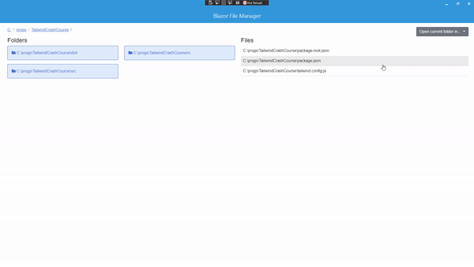

# Blazor-File-Manager
Blazor &amp; Native Desktop!

- Colors display in user's chosen theme
- View folders & files on PC
- Open files in their default program
- Open selected folder in command line or in file explorer

